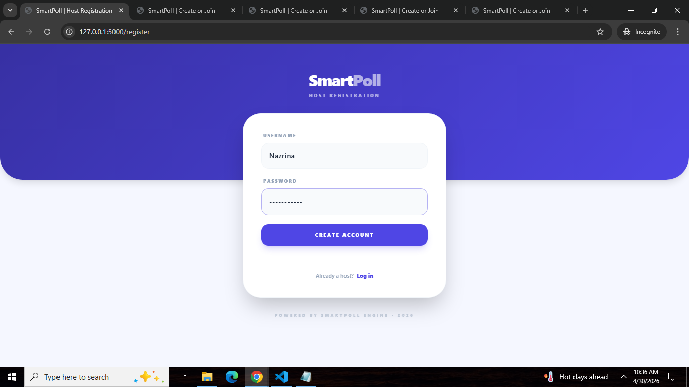
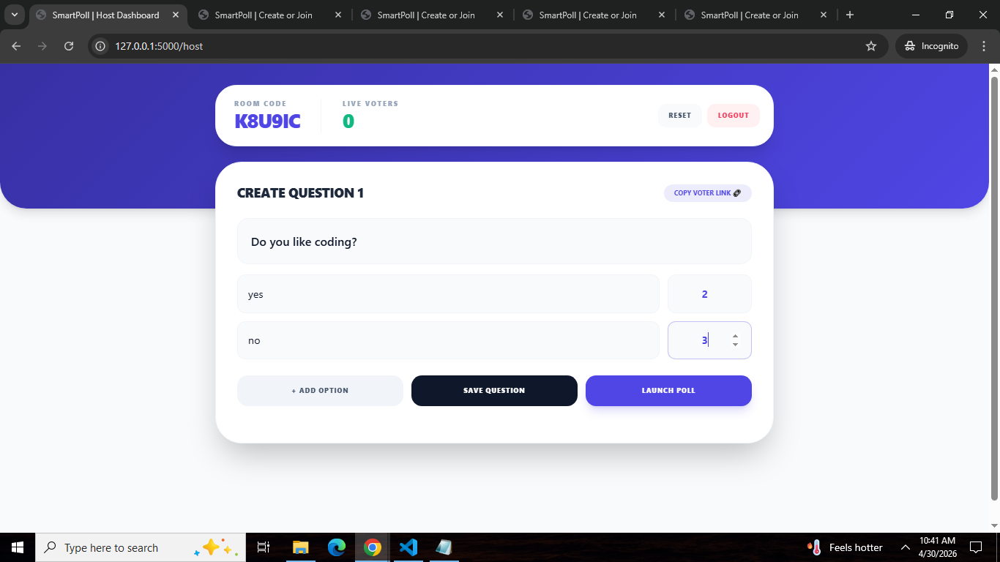
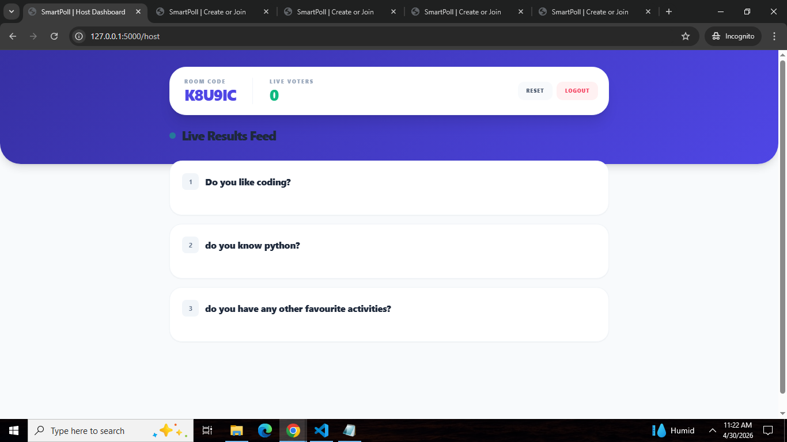
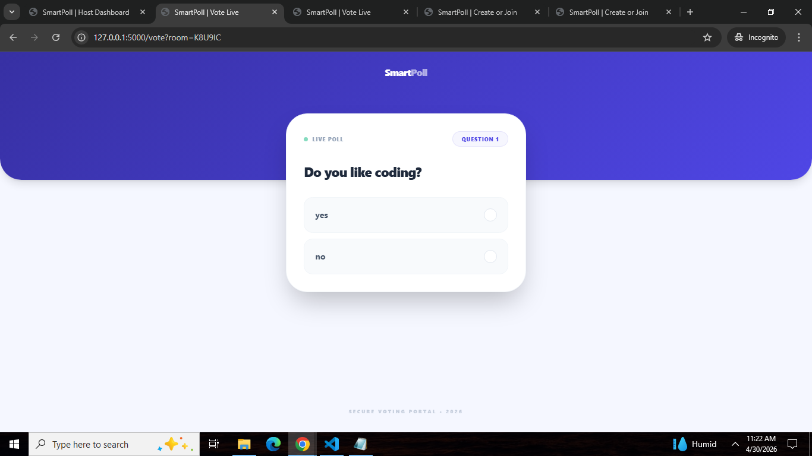
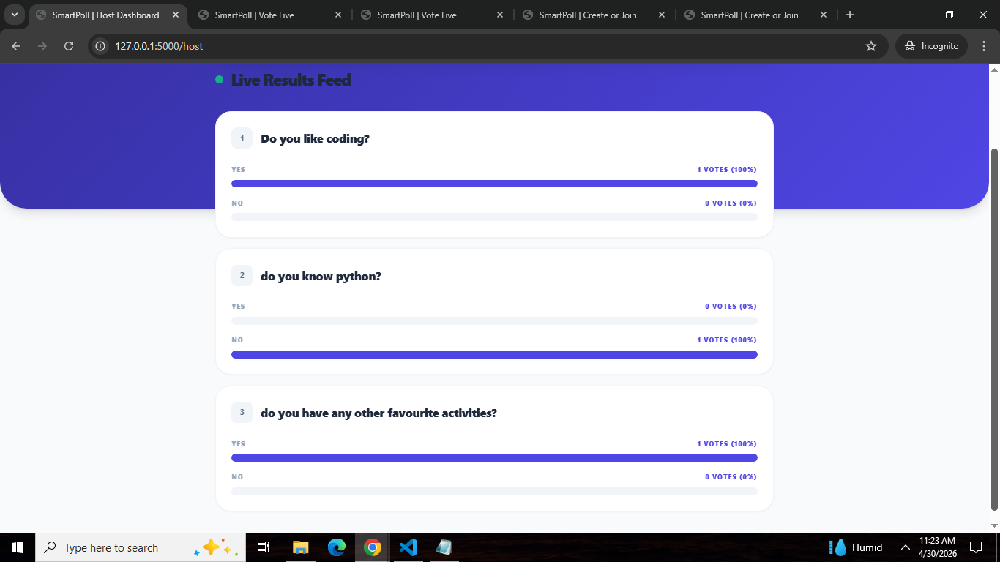

# 🗳️ SmartPoll

A realtime polling web application where hosts can create dynamic branching polls and watch live results update instantly — without a single page refresh.


---

## 🚀 Live Demo
🔗 Coming Soon

---

## 📸 Screenshots









---

## ✨ Features

### 🔴 Realtime Live Results
Vote counts update **instantly across all connected devices** using WebSocket connections — no page refresh needed. The host dashboard reflects every vote the moment it's cast.

### 🌿 Smart Branching Logic
Polls support **conditional question flow** — different voters can be routed to different questions based on their answers. Branch target questions are hidden from the normal flow and only shown when explicitly jumped to.

### 🔐 User Authentication
- Secure registration and login system
- Passwords hashed with `pbkdf2:sha256`
- Session management with Flask-Login

### 🛡️ Anti Double Voting
Every vote is tracked against a unique voter ID and question index — preventing the same voter from submitting duplicate answers.

### 🏠 Room System
Hosts create a unique **6-character room code** that voters use to join. Multiple rooms can run simultaneously with isolated results.

---

## 🛠️ Tech Stack

| Layer | Technology | Purpose |
|---|---|---|
| Backend | Python, Flask | Server and routing |
| Realtime | Flask-SocketIO + Eventlet | Live vote updates via WebSockets |
| Database ORM | SQLAlchemy | Database management |
| Authentication | Flask-Login + Werkzeug | Secure user sessions |
| Frontend Styling | Tailwind CSS | Responsive UI |
| Database | SQLite (dev) / PostgreSQL (prod) | Data persistence |

---

## ⚙️ Run Locally

**1. Clone the repo**

```bash
git clone https://github.com/nazrin19/smartpoll.git
cd smartpoll
```

**2. Create a virtual environment**

```bash
python -m venv venv
venv\Scripts\activate
```

**3. Install dependencies**

```bash
pip install -r requirements.txt
```

**4. Set up environment variables**

Create a `.env` file in the root folder:

```
SECRET_KEY=your_secret_key_here
DATABASE_URL=sqlite:///poll.db
DEBUG=True
```

**5. Run the app**

```bash
python app.py
```

Open your browser at `http://localhost:5000` 🎉

---

## 🗂️ Project Structure

```
smartpoll/
├── app.py
├── Procfile
├── requirements.txt
├── README.md
├── .gitignore
├── Screenshots/
├── templates/
│   ├── index.html
│   ├── host.html
│   ├── vote.html
│   ├── login.html
│   └── register.html

```

---

## 🔄 How It Works

```
Host creates a room → gets a 6-character code
        ↓
Voters join using the code
        ↓
Host starts the poll
        ↓
Voters answer questions (with smart branching)
        ↓
Every vote → instantly updates host dashboard via WebSocket
        ↓
Host sees live results in realtime ⚡
```

---

## 🔮 Future Improvements

- [ ] AI-generated poll questions using Gemini API
- [ ] Poll analytics dashboard
- [ ] Poll expiry timer
- [ ] Share polls via link
- [ ] Export results as CSV

---

## 👨‍💻 Author

**N.Nazrina Banu**
- LinkedIn: [linkedin.com/in/nazrina-banu-22a24b3b9](http://www.linkedin.com/in/nazrina-banu-22a24b3b9)
- GitHub: [github.com/nazrin19](https://github.com/nazrin19)

---

## 📄 License

This project is open source and available under the [MIT License](LICENSE).